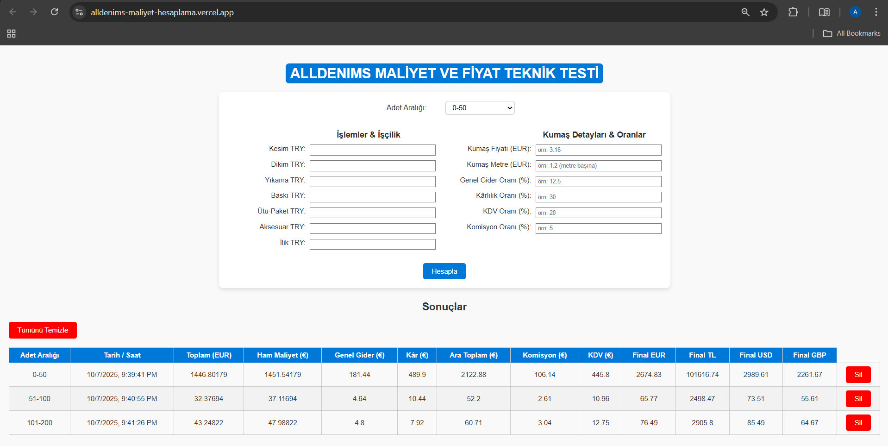

# ALLDENIMS Maliyet ve Fiyat Teknik Testi

## 🎯 Proje Amacı
Bu proje, ALLDENIMS firmasının Excel tabanlı maliyet hesaplama sistemini modern, kullanıcı dostu bir **web uygulamasına** dönüştürmek amacıyla geliştirilmiştir.  
Amaç, Excel'deki maliyet hesaplama mantığını **backend** tarafında yeniden kurarak, **frontend** üzerinden interaktif bir şekilde kullanılmasını sağlamaktır.

---

## 🧮 Proje Özeti
Kullanıcılar, Excel dosyasındaki girdileri web arayüzü üzerinden doldurur.  
Girilen değerler backend'e gönderilir ve aynı Excel mantığıyla hesaplanan sonuçlar ekrana getirilir.

💱 Canlı Döviz Kurları
Proje, hesaplamalarda kullanılan döviz dönüşümlerini gerçek zamanlı olarak alır.
Backend tarafında, ExchangeRate API servisi kullanılarak güncel döviz kurları çekilmektedir.
Bu API, temel para birimi olarak Euro (EUR) üzerinden çalışır ve diğer para birimlerinin (örneğin USD, TRY, GBP) anlık kur değerlerini döndürür.

Bu sayede sistem, Euro (EUR) tabanlı fiyatları her istekte en güncel USD, TRY ve GBP değerlerine göre otomatik olarak dönüştürür.
Kurların API üzerinden dinamik olarak alınması, hesaplamaların her zaman güncel piyasa verilerine dayanmasını sağlar.

---

## 🧠 Input ve Output Alanları

### 📝 Girdi Alanları (Inputs)
- **Adet Aralığı** → 0-50, 51-100, 101-200 (dropdown)
- **Kesim TRY**
- **Dikim TRY**
- **Yıkama TRY**
- **Baskı TRY**
- **Ütü-Paket TRY**
- **Aksesuar TRY**
- **İlik TRY**
- **Kumaş Fiyatı (EUR)** — örn: `3.16`
- **Kumaş Metre (EUR)** — örn: `1.2`
- **Genel Gider Oranı (%)** — örn: `12.5`
- **Kârlılık Oranı (%)** — örn: `30`
- **KDV Oranı (%)** — örn: `20`
- **Komisyon Oranı (%)** — örn: `5`

### 📤 Çıktı Alanları (Outputs)
- **Toplam (EUR)**
- **Ham Maliyet (€)**
- **Genel Gider (€)**
- **Kâr (€)**
- **Ara Toplam (€)**
- **Komisyon (€)**
- **KDV (€)**
- **Final EUR**
- **Final TL**
- **Final USD**
- **Final GBP**

---

## ⚙️ Hesaplama Mantığı (Özet)
Excel’deki formüller backend’e taşınmıştır.

1. **Toplam (EUR)** → `(Kesim + Dikim + Yıkama + Baskı + Ütü + Aksesuar + İlik TRY)` toplamı, Euro kuruna göre çevrilir.
1. **Ham Maliyet (€)** → `Toplam (EUR) + (Kumaş Fiyatı (EUR) * Kumaş Metre (EUR)) `
2. **Genel Gider (€)** → `Ham Maliyet * (Genel Gider Oranı / 100)`
3. **Kâr (€)** → `(Ham Maliyet + Genel Gider) * (Kârlılık Oranı / 100)`
4. **Ara Toplam (€)** → `Ham Maliyet + Genel Gider + Kâr`
5. **Komisyon (€)** → `Ara Toplam * (Komisyon Oranı / 100)`
6. **KDV (€)** → `(Ara Toplam + Komisyon) * (KDV Oranı / 100)`
7. **Final EUR** → `Ara Toplam + Komisyon + KDV`
8. **Final TL / USD / GBP** → Güncel döviz kurlarıyla çarpılarak hesaplanır.

---

## 🧩 Kullanılan Teknolojiler

### Backend
- **Python (FastAPI)**
- **Uvicorn**
- **Requests** (döviz API çağrısı için)
- **Render Deployment**

### Frontend
- **HTML / CSS / JavaScript**
- **Fetch API (Backend ile iletişim için)**
- **Local Storage (Geçmiş kayıtlar için)**
- **Vercel Deployment**

---

## 🚀 Kurulum ve Çalıştırma

### 1️⃣ Projeyi Klonlayın
```bash
git clone https://github.com/kullanici-adi/alldenims-maliyet-hesaplama.git
cd alldenims-maliyet-hesaplama
```

### 2️⃣ Backend’i Başlatın
```bash
cd backend
python -m venv venv
venv\Scripts\Activate
pip install -r requirements.txt
uvicorn main:app --reload
```
Backend çalıştığında şu adreste aktif olacaktır:  
👉 **http://127.0.0.1:8000**

### 3️⃣ Frontend’i Başlatın
Ayrı bir terminalde:
```bash
cd frontend
```

`script.js` dosyasında aşağıdaki satırı bul ve backend adresini **lokal veya canlı URL** ile değiştir:

```js
const API_URL = "https://alldenims-maliyet-hesaplama.onrender.com"; 
// Lokal çalıştırmak için şunu kullan:
// const API_URL = "http://127.0.0.1:8000";
```

Ardından frontend'i başlatmak için (örneğin Live Server veya VS Code ile) index.html dosyasını aç

---

## 🌐 Canlı Demo
- **Backend:** [https://alldenims-maliyet-hesaplama.onrender.com](https://alldenims-maliyet-hesaplama.onrender.com)
- **Frontend:** [https://alldenims-maliyet-hesaplama.vercel.app/](https://alldenims-maliyet-hesaplama.vercel.app/)

---

## 🧾 API Dokümantasyonu

### **POST /calculate**
Backend, Excel formüllerine göre maliyet hesaplaması yapar.

#### 🧩 Örnek İstek
```json
{
  "quantity_range": "0-50",
  "cutting_try": 5,
  "sewing_try": 8,
  "washing_try": 3,
  "printing_try": 2,
  "ironing_try": 4,
  "accessories_try": 6,
  "buttonhole_try": 1,
  "fabric_price_eur": 3.16,
  "fabric_meter_eur": 1.2,
  "general_expense_ratio": 12.5,
  "profit_ratio": 30,
  "kdv_rate": 20,
  "commission_rate": 5
}
```

#### 🧾 Örnek Yanıt
```json
{
  "TOPLAM (EUR)": 32.37694,
  "Ham Maliyet (€)": 37.11694,
  "Genel Gider (€)": 4.64,
  "Kâr (€)": 10.44,
  "Ara Toplam (€)": 52.2,
  "Komisyon (€)": 2.61,
  "KDV (€)": 10.96,
  "Final EUR": 65.77,
  "Final TL": 2498.47,
  "Final USD": 73.51,
  "Final GBP": 55.61
}
```

---

## 📸 Ekran Görüntüsü



---

## 📊 Değerlendirme Kriterlerine Uygunluk

✅ **Doğruluk:** Excel hesaplamaları birebir backend’e aktarılmıştır.  
✅ **Kod Kalitesi:** Modüler, okunabilir ve tekrarsız yapı.  
✅ **Arayüz:** Basit, kullanıcı dostu, validasyonlu form.  
✅ **Deployment:** Render & Vercel üzerinde canlı olarak yayında.  
✅ **Dokümantasyon:** Kurulum, API açıklaması ve ekran görüntüsü dahil.

---

## 👨‍💻 Geliştirici
**Ali Üre**  
Software Engineering — Istanbul Health and Technology University  
Gmail — ureali90@gmail.com

